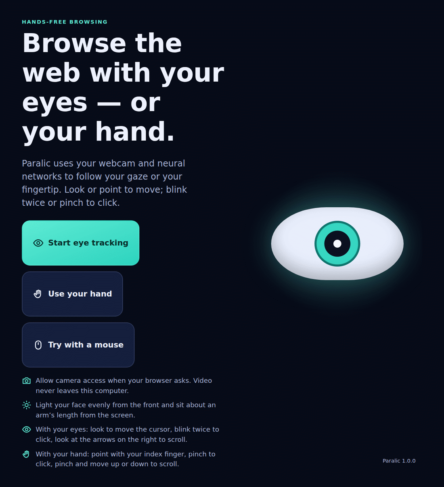
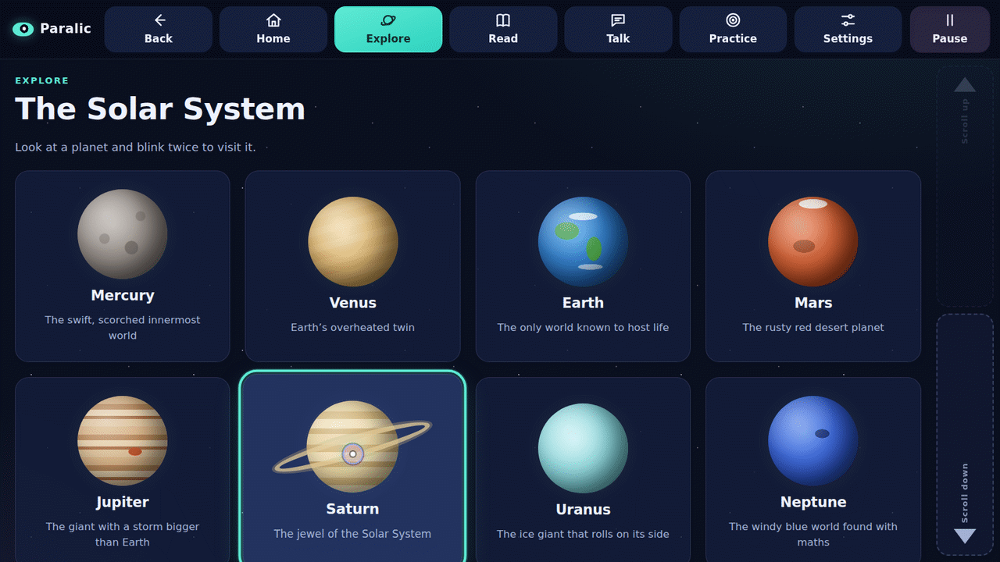
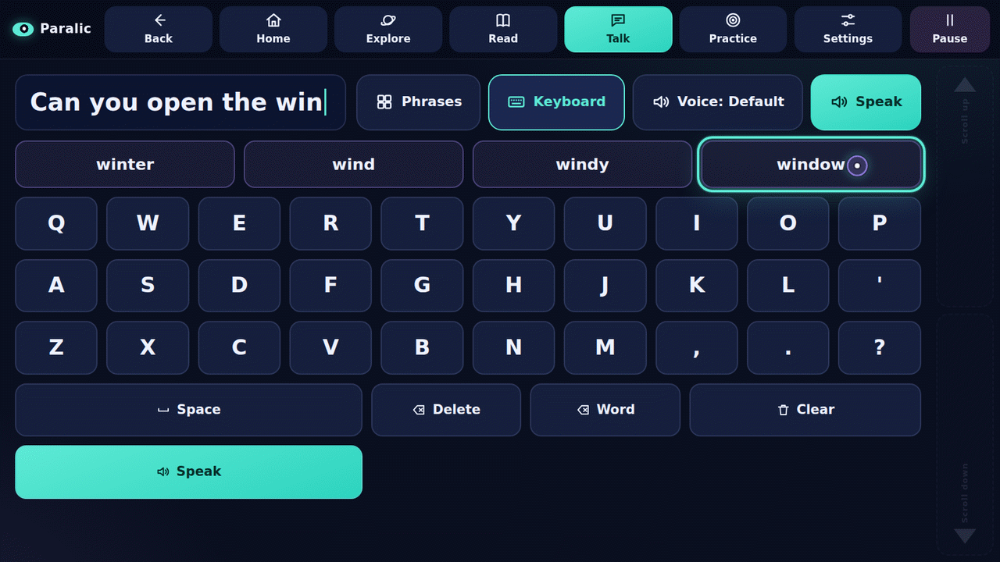
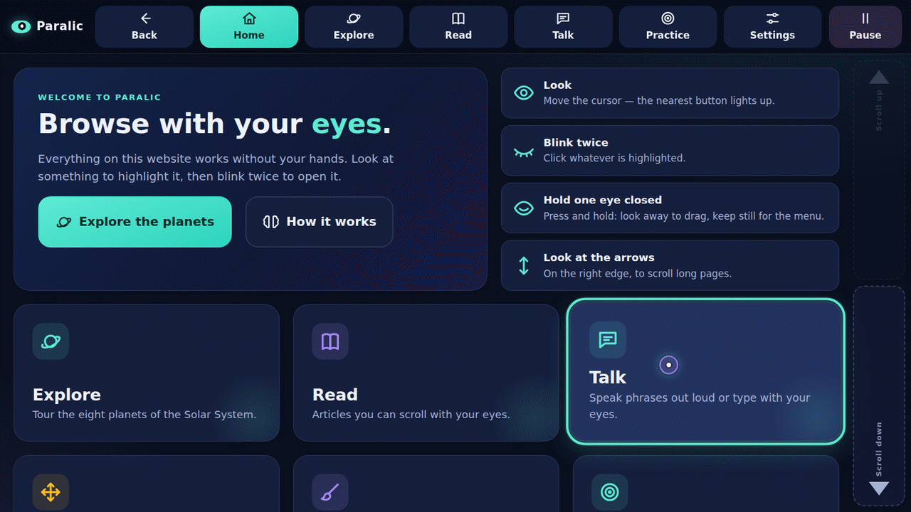
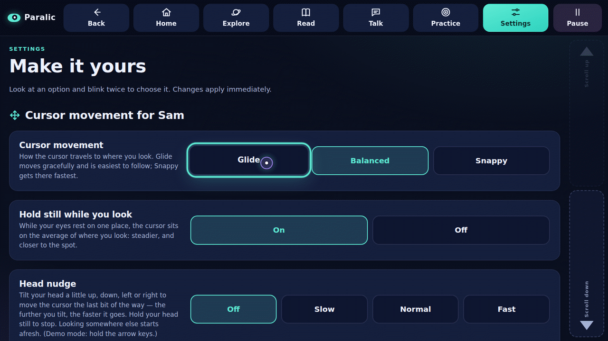

# Paralic — browse the web with your eyes

Paralic is a website that runs on your own computer (`http://localhost`) and can be used **with your eyes only**.
A Python server uses **neural networks** to track your eyes through an ordinary webcam:

* **look** somewhere and the cursor moves there (it gently snaps to the nearest button),
* **blink twice** to click,
* **hold one eye closed** to press and hold — look elsewhere to **drag**, keep still for a **right-click menu**,
* **look at the arrows on the right edge** to scroll,
* **blink twice on Pause** to rest your eyes, and blink twice again to resume.

For people who find blinking or winking hard there are alternatives: **dwell click** (rest your eyes on a
button), **closing both eyes for a second**, and a menu that can pick things up and drop them. Or use
**your hand** instead of your eyes — point with your index finger and pinch to click (see
[Hand mode](#hand-mode-finger-gestures)). Everything is **personalised per person**: each person who uses
the computer gets their own gaze network, blink and wink thresholds, hand setup and settings, which keep
improving while they use the site — and Paralic recognises who is sitting at the camera by their face.

What changed in each version: [CHANGELOG.md](CHANGELOG.md).

The site itself is designed for eye control: big targets, a Solar System to explore, articles to read,
a *Talk* page with 175 spoken phrases and an eye-typing keyboard whose word prediction learns your own words,
a drag-and-drop game, a drawing canvas, a target-practice game, *Trail Shooter* (walk a trail at night and
blink to stop the creatures), and settings you can change with your eyes.

## Paralic in pictures

<p align="center">
  
</p>
<p align="center"><em>The start screen: one click for the eyes, one for a hand, or try it with the mouse.</em></p>

<p align="center">
  
  
</p>
<p align="center"><em>Explore and Talk in the mouse demo mode: the round cursor is where the “eyes” look, and the button under it lights up.</em></p>

---

## Quick start

You need **Python 3.9 or newer** (3.10–3.12 recommended), a **webcam**, and **Chrome, Edge or Firefox**.

```bash
git clone https://github.com/smoke-wolf/Paralic.git
cd Paralic
./start.sh          # macOS / Linux
start.bat           # Windows (double-click or run in a terminal)
```

The start script creates a virtual environment, installs the dependencies (first run only), starts the
server and opens **http://localhost:8000** in your browser. On first start it also downloads MediaPipe's
face model (3.7 MB) into `models/`.

Prefer doing it by hand?

```bash
python -m venv .venv
source .venv/bin/activate            # Windows: .venv\Scripts\activate
pip install -r requirements.txt
python -m paralic                    # or: python run.py
```

Options: `--port 8080`, `--no-browser`, `--host`, `--model PATH`, `--data-dir DIR`, `--verbose`.
If port 8000 is busy the next free one is used.

> No webcam? Click **Try with a mouse** on the start screen (or open `http://localhost:8000/?demo`).
> The mouse then plays the part of your eyes: press **B** twice quickly for a double blink, hold **B** for a
> second to close both eyes, and hold **Q** / **E** to keep your left / right eye closed. With the head nudge
> switched on, the arrow keys tilt the "head".

## Using it

1. **Start eye tracking** – the only click you need. Allow the camera when the browser asks.
   (Once allowed, Paralic starts the camera by itself next time.)
2. **Camera check** – centre your face; the eyes are outlined when they are found.
3. **Blink twice to calibrate** (about a minute and a half). First *get comfortable*: the camera view shows one
   hint at a time (closer, a little to the left, more light in front of you…) until the face is centred, at a
   good distance and evenly lit — a double blink skips it if you cannot move. Then look at each dot until it
   shrinks away: a dot waits until your eyes have settled on it, so slower eyes simply get more time. When
   asked, keep looking at the centre dot while you turn, nod and tilt your head a little (skip that if moving is
   hard for you — just keep looking). Your personal neural networks are trained and five more dots measure the
   accuracy. **If it is not yet good, up to three more short rounds run by themselves**: extra dots where the
   tracking was least sure (between the grid, then edges and corners), a new network, and five new dots to
   measure it — the better network always stays, so a round never makes it worse. *Make it even better* on the
   results screen runs another round any time. Finally you blink twice three times when the dot turns purple,
   so double blinks are tuned to how *you* blink.
4. **Start browsing** – look at it and blink twice.

| Gesture | What it does |
| --- | --- |
| Look | Moves the cursor. The nearest button lights up. |
| Blink twice | Clicks what was highlighted *just before the first blink*. A small “1” shows after the first blink. |
| Hold one eye closed | Presses and holds where you were looking. Look elsewhere while it stays closed to **drag** (or draw); open it to drop. Keep looking at the same spot for a second for the **menu** (a right click: Click · Pick up to move · Read aloud). Open it again quickly to click. |
| Close both eyes ~1 s *(optional)* | Menu, pick up / drop, or click — for people who cannot close one eye on its own. |
| Rest your eyes on a button *(optional)* | Dwell click: a ring fills on the cursor, then it clicks. |
| Look at *Scroll up / Scroll down* (right edge) | Scrolls; look further towards the arrow to go faster. Blink twice there to jump a page. |
| Blink twice on *Pause* | Pauses (nothing gets clicked). Blink twice to resume. |


*Home in the mouse demo mode: the round cursor shows where the “eyes” look and the tile under it lights up; a double blink would open it.*

Each person's calibration is saved (numbers only, no images) in `data/users/<id>/`. Several people can share
the computer: Paralic asks who is using it. Next time you can use your calibration as is, do a
**Quick adjust** (eyes only: first back to where you sat while calibrating, then 9 dots and 5 dots that measure
the result, ~30 seconds; if it is below *good* you can let it improve with extra rounds) or a full calibration. Quick adjust and full calibration are also on the Home and Settings pages; the Lab page has a
**mouse-guided tune-up** for a helper (the mouse pointer marks where the eyes look). A calibration from an
older version keeps working (a full calibration makes it more accurate; the old file is kept as a backup).

**Helper shortcuts** (for someone assisting): `C` full calibration · `A` quick adjust · `P` pause/resume ·
`Esc` cancel calibration / drop a carried item / close the menu · `F11` full screen.

## Accessibility: other ways to click, hold and drag

Paralic is meant for people who cannot use their hands, and eyes differ a lot from person to person —
a drooping lid, a squint, facial palsy, involuntary blinks, fatigue. So there is more than one way to do
everything, chosen per person in **Settings → Eye gestures**:

* **Winks work like a mouse button.** Close one eye and keep it closed (≥ 0.35 s, adjustable): that presses
  where you were looking. Look somewhere else to drag; keep still for a second for the menu (a *long press*,
  i.e. a right click); open it quickly for a click. Each eye can be *press & drag*, *right-click menu* or off.
  On any page a held wink is an ordinary pressed pointer, so dragging and drawing work like with a mouse
  (try **Arrange** and **Draw**).
* **The cursor keeps following you while one eye is closed.** Besides the network that reads both eyes, every
  calibration trains a network for each eye alone; during a wink the open eye's network takes over, aligned to
  the usual one so the cursor does not jump.
* **Test my winks** checks each eye ("close your left eye… now your right eye") and personalises the wink
  thresholds — many people squint the other eye a little when winking, which is fine. An eye that cannot wink
  on its own is ignored, so it never presses by accident.
* **Closing both eyes for about a second** can open the menu, pick up / drop things, or click. It has to be a
  real closure: looking at the bottom of the screen (which also lowers the lids) does not count.
* **Dwell click** clicks by resting the eyes on a button (0.6–2 s) — no blinking at all.
* **Pick up to move** (in the menu) carries an item without holding anything; blink twice, dwell or close your
  eyes again to drop it.
* **Short winks** can click or open the menu (off by default).
* **Lopsided blinks and eyes that don't close fully**: the blink test chooses what to watch — both eyes, their
  average, or one eye (e.g. with facial palsy) — and how lopsided ordinary blinks are, so that winks have to
  be clearly more one-sided than blinks.
* **A squint or an unreliable eye**: cross-validation compares "both eyes" with each eye alone and lets a single
  eye lead when the other one misleads (e.g. a squint that comes and goes). *Tracking eye* in Settings can also
  force one eye (an eye patch, a prosthetic eye).

**Face print — Paralic knows who is using it** (per person, Settings → *Recognise my face*): while you use
Paralic it keeps a few different views of your face (other head poses, other light) and recognises you the next
time, opening your profile by itself ("Hello, Sam! I recognised you"); if someone else with a face print sits
down it asks "Is that Alex?". When it is not sure it simply asks who you are. New views are only learned while
the camera keeps following the face of the person who chose themselves (or was recognised), so a print never
takes in someone else's face — and it keeps getting better. *Forget my face* (Lab page) deletes it; switching it
off deletes it too. This is a convenience, not security: a photo would fool it.

**Someone else in view** — a friend looking over your shoulder, a carer sitting beside you: Paralic sees up to
three faces but only the person it is following controls the cursor. Everyone else's blinks and head movements
change nothing, and the corner camera view outlines *You* and *Ignored*. If you look away or step out while
someone else stays in view, nobody controls Paralic until you are back — it knows you by your place (for ten
seconds) and by your face print — so a bystander never takes over. In hand mode, the hand in control keeps
control when another hand comes into view.

**Settings → Cursor movement** (per person):

* **Cursor movement**: *Glide* / *Balanced* / *Snappy* — the cursor eases to where you look (it never jumps or
  overshoots); Glide is the calmest and easiest to follow, Snappy the quickest.
* **Hold still while you look**: while the eyes rest on one place the cursor sits on the average of where they
  look — steadier, and closer to the spot. A real eye jump moves it on at once.
* **Head nudge** (off by default): tilt the head a little up, down, left or right to move the cursor the last bit
  of the way, like a joystick — the further you tilt, the faster it goes; hold the head straight to stop. Looking
  somewhere else starts afresh. *Check head directions* learns which way is which for you and how far you
  comfortably tilt.


*Balanced movement with “Hold still while you look” on, for a simulated person: the cursor rests on the average of each fixation and moves on when the eyes jump.*

## Glasses

Paralic notices glasses, and reflections on their lenses, on every camera frame (`paralic/glasses.py`):

* **Glasses or not.** The bridge of a frame makes a horizontal edge right across the nose, where bare skin has
  hardly any; rims below the eyes add to it. The edges are measured against the skin's own edges nearby (forehead
  and cheeks), so the light and the skin's texture don't matter, and the result is smoothed with hysteresis, so it
  does not flicker.
* **A calibration with glasses and one without.** Glasses change how the eyes look to the camera, so every
  calibration records whether glasses were worn, and each person keeps one of each
  (`data/users/<id>/profile-glasses.json` next to `profile.json`). The one that fits is loaded; when there is
  only the other one it is used, and the page suggests a quick adjust — which is then kept as the calibration
  with glasses (or without). Put your glasses on or take them off while using Paralic and, a few seconds later,
  the page offers your other calibration or a quick adjust. Calibrations from before keep working as they did.
* **Reflections.** A lamp or window reflected in a lens hides that eye from the face mesh. The small reflection on
  the eye that everyone has does not count; a larger bright, colourless patch over or next to the eye does. While
  it covers one eye the cursor follows the other eye's network (aligned like during a wink, so it does not jump;
  a wink still comes first). Calibration dots leave out frames where a reflection came and went; if it stays, the
  frames are kept — so calibrating stays possible — and the page warns you. The *get comfortable* step shows the
  same hint: tilt the screen a little or move the lamp.

On glasses painted onto test faces (many brightnesses, tilts and sizes) every dark full-rim, half-rim and rimless
frame was seen, and no face without glasses or with frown lines was taken for one; thin metal frames close to the
skin's colour go unnoticed ([docs/glasses.md](docs/glasses.md)).

## Personalisation

* **People** — each person has their own profile (`data/users/<id>/`): gaze networks, calibration data, blink
  and wink thresholds, gestures, smoothing, magnet and experiment results.
* **Learning from use** — the moments before you pop a practice target or click a button become labelled
  training data. In the background a *challenger* network (the current one fine-tuned, and a fresh per-person
  model search over several architectures) must beat the current *champion* on your most recent, held-out
  clicks (paired sign-flip test, capped errors, ≥ 50 % win rate) before it replaces it; implausible labels are
  dropped first.
* **Auto settings** — cursor smoothing is tuned to your measured jitter, the button magnet to your accuracy.
* **Personalization Lab** (`#/lab`) — shows what was learned and runs **blind A/B experiments** (smoothing,
  magnet, double-blink timing, dwell time): each round is a shuffled, balanced set of targets where every
  target secretly uses one variant; a permutation test decides, and a clear winner becomes your default.

![Two dumbbell charts from the benchmark on simulated people. Left, gaze error without and with personalisation: a quick adjust after sitting differently brings 70–200 px down to about 20 px; learning from use brings about 130 px down to 35–50 px, changes little when nothing moved, and refuses labels that are all wrong. Right, double blinks and held winks caught with standard and with personal thresholds: light blinks, an eye that barely closes and gentle winks go from none to all; the others are all caught either way](docs/images/personalisation-benchmark.png)
*What personalisation does, measured on simulated people ([docs/benchmark.md](docs/benchmark.md)): simulations, not measurements on real people.*

**Fully hands-free:** after the camera permission has been granted once, the site starts tracking without a
click. For a kiosk-style setup, launch the browser in full screen, e.g.
`chrome --kiosk --autoplay-policy=no-user-gesture-required http://localhost:8000` (the autoplay flag lets the
*Talk* page speak without a first click).

## Hand mode (finger gestures)

Prefer your hand? On the start screen choose **Use your hand** (or open
`http://localhost:8000/?hands`), and switch back any time in **Settings → Control
with**. Paralic remembers the choice and starts that way next time. A second
neural network — MediaPipe HandLandmarker — tracks your hand through the same
webcam, and finger gestures do everything:

| Gesture | What it does |
| --- | --- |
| Point your index finger | Moves the cursor (it still snaps to the nearest button). |
| Pinch (thumb + index), then let go | Clicks what the cursor pointed at just before your fingers started to close. |
| Pinch and move your hand up / down | Scrolls the page. |
| Hold up an open hand, fingers spread, thumb out | Pauses — and the same again resumes. A pinch never resumes, so a stray pinch can't click while paused. |

The first time, a short **hand setup** (about a minute, spoken step by step)
learns your hand: its size, a map from the range your finger comfortably moves
in to the whole screen (13 dots), and your own pinch — distances are split into
"open" and "closed" with your range, so a hand that can't close fully still
clicks reliably. It ends with a little practice (with a time limit and a Skip
button). **Quick re-point** redoes only the dots and keeps your pinch.


*The hand network on public test photos (cropped to the hands), and the hand setup's personal pinch for a simulated hand that cannot close fully.*

Everything else is shared with eye mode: the people on this computer (each with
their own hand setup in `data/users/<id>/hand.json`), personal settings and
desktop control. Distances are measured in palm widths, so it works at any
distance from the camera; a hand lost for a frame or two keeps its pinch; and a
flat pointing hand never pauses by accident. The hand model downloads in the
background the first time (`/api/status` reports `hands: loading`), so eye mode
never waits for it. Code: `paralic/hands.py` (tracker), `paralic/hand_gestures.py`
(recogniser), `paralic/hand_control.py` (the per-frame pipeline and setup), used
by `paralic/session.py` when the page connects with `/ws?mode=hand`.

## How it works

```
 Browser (web/)                                   Python server (paralic/), on localhost
 ─────────────                                    ───────────────────────────────────────
 webcam ─► JPEG frames ──── WebSocket /ws ─────►  MediaPipe FaceLandmarker  (neural networks)
                                                    • face detector (BlazeFace)
                                                    • face mesh: 478 landmarks incl. irises
                                                    • blendshape network: eyeBlink, eyeLookUp…
                                                    • head pose (transformation matrix)
                                                            │
                                                  features: iris position in each eye, eyelid
                                                  opening, eye blendshapes, head rotation/position
                                                            │
                                                  GazeNet: your personal neural networks ─► screen x, y
                                                  (both eyes; each eye alone during a wink)
                                                            │
                                                  One Euro smoothing · blink freeze · blink, wink and
                                                  long-close detectors
 gaze cursor, snapping, clicks, drags, menu ◄─ JSON ─ gaze point + "double_blink", "wink_start/end",
 scrolling, dwell clicks                              "long_close" … events
```

* **MediaPipe FaceLandmarker** (Google) finds the face, places 478 landmarks (10 around the irises),
  scores 52 facial blendshapes and estimates the head pose, ~10 ms per frame on a laptop CPU.
* **Features** (`paralic/features.py`): for each eye, where the iris sits between the eye corners and between
  the lids, how open the lids are (relative to the eye, so distance does not matter), the eye axis' tilt, the eye
  blendshapes, and head yaw/pitch/roll/position — 28 numbers per frame.
* **Calibration labels** (`paralic/calibration.py`): a dot is only learned from frames where the eyes really
  rested on it. Each dot's frames are split into steady stretches where the mean eye position changes
  (measured in units of the person's own frame-to-frame noise); frames still on the previous dot, on the way,
  or glancing at the instructions are left out, and the page keeps a dot up until enough settled frames have
  arrived. A dot the eyes were never really on (closed, looking elsewhere) is spotted because the other dots
  predict it badly (leave-one-dot-out with a small ridge model) and is left out of training.

  
  *Which frames and dots count, on simulated eyes run through the labelling code that training uses.*

* **GazeNet** (`paralic/gazenet.py`) is a small multilayer perceptron written in NumPy: two tanh hidden
  layers (32 → 16) plus a linear skip connection that is initialised with ridge regression, trained with Adam
  and a Huber loss. The weight decay is chosen by *grouped cross-validation* (whole calibration dots are held
  out, so it measures how well the network interpolates to new screen positions) and three networks are
  averaged. The head-movement step of the calibration teaches it to compensate for head motion. Training
  takes about a second.

  
  *What a personal network learns from one calibration, for a simulated person: in simulation, not a real-world accuracy.*

* **One-eye networks**: the same architecture trained on one eye's features plus the head pose. They keep the
  cursor moving during a wink and can lead for people whose other eye does not track reliably.
* **Blink detection** (`paralic/blink.py`) combines MediaPipe's blink blendshapes with the eyelid geometry,
  with thresholds that adapt to your eyes and to lids dropping when you look down. By default it watches the
  more open eye, so a wink is never a blink. A double blink is two blinks with a short pause between them;
  long eye closures never count (but a deliberate, deep one of 1–6 s is a *long close*).
* **Wink detection** (`paralic/gestures.py`) gives each eye its own adaptive baseline and looks for one eye
  closing while the other stays open; held for a moment it becomes a press.
* **Smoothing** (`paralic/filters.py`): a One Euro filter keeps the cursor steady while you look at something
  but quick when your eyes jump. When your eyes start to close the cursor freezes at where you were
  looking just before, so the double blink clicks the right thing.
* **Screen coordinates:** the network predicts positions on your *monitor*; the page converts them into page
  coordinates, so leaving full screen or moving the window keeps the calibration usable.
* **Face print** (`paralic/faceprint.py`): each kept view is described by *face deltas* — 47 face-mesh points that
  expressions barely move (eye corners, nose, forehead, cheekbones, temples, jaw angles) in a frame fixed to the
  face (origin between the eyes, axes from the eye line and the nose, lengths in eye distances), so head pose
  and distance drop out — and by local-binary-pattern texture histograms of the face aligned by the eyes. They
  are compared with a **learned matrix weighting**: the differences between one person's own views are pooled
  into a covariance and inverted (whitening: what varies within a person counts little, what is steady counts a
  lot), the directions that separate the enrolled people's mean faces get extra weight, and shape and texture
  are weighted by how well each separates people. It is learned from the views themselves, cross-validated
  (learned on part of each person's views, measured on the rest), so a score means "how many times further
  than a new view of this person's own face"; a face is theirs below 3 and when clearly closer to them than to
  anyone else. On public test faces (altered in angle, scale, light and sharpness) it recognised every enrolled
  face and turned every stranger away.

  
  *The face print on public test faces: only landmarks and scores are drawn, no photo.*

* In the page (`web/js/gaze.js`, `web/js/motion.js`) the cursor glides at 60 fps on a critically damped spring,
  rests on the average of each fixation, can be nudged with small head tilts, snaps to the nearest button, and
  each click slightly corrects any drift (you can turn this off in Settings).

Note that the website draws its own gaze cursor; the operating system's mouse pointer is not moved (the
real mouse keeps working as usual, which is handy for a helper).

## Getting good accuracy

* Light your face evenly from the front; avoid a bright window behind you. (The *get comfortable* step checks
  this before calibrating.)
* Put the webcam at the top centre of the screen and sit about an arm's length (50–70 cm) away.
* Use full screen (`F11`) for the largest targets, and calibrate the way you will sit.
* If the cursor drifts, run **Quick adjust** — it first guides you back to where you sat while calibrating,
  which is where the network is most accurate; if it is far off, recalibrate.
* *Hold still while you look* (on by default) averages out the jitter; the head nudge covers the last few
  pixels.
* Webcam eye tracking is accurate to roughly 1–3 cm on the screen — that is why the site uses big buttons.

## Settings (all changeable with your eyes)

Per person: cursor movement (glide / balanced / snappy) · hold still while you look · head nudge and its
speed (with a head-direction check) · what holding each eye closed does · short winks · closing both eyes ·
dwell click and its time · wink hold time · tracking eye · wink and blink tests · recognise my face.
In this browser: cursor smoothing (Auto = learned) · snap to buttons (Auto) · double-blink speed (Personal) ·
blink sensitivity (Personal) · scroll speed · learn from clicks (drift correction) · keep learning my eyes
(fine-tuning) · cursor size · camera preview · sounds · speaking speed.
Missed double blinks → run the blink test, or *Relaxed* speed / *High* sensitivity. Unwanted clicks → *Low*
sensitivity or *Fast*, or switch to dwell click.


*Settings are large buttons too: look at an option and blink twice (mouse demo mode).*

## Troubleshooting

| Problem | Fix |
| --- | --- |
| Camera blocked | Click the camera icon in the address bar, allow it, press Start again. On macOS also check *System Settings → Privacy & Security → Camera* for your browser. |
| “No camera found” / camera busy | Plug in a webcam; close other apps using it (Zoom, Teams…). |
| Camera doesn't work when opening the page by IP address | Browsers only allow cameras on `localhost` or HTTPS: use `http://localhost:8000`. |
| “MediaPipe could not start … libEGL” (Linux) | `sudo apt install libegl1 libgles2` |
| Model download failed | Download [face_landmarker.task](https://storage.googleapis.com/mediapipe-models/face_landmarker/face_landmarker/float16/1/face_landmarker.task) and save it as `models/face_landmarker.task`. |
| `pip` can't find `mediapipe` | Use Python 3.9–3.12 (Intel Macs need ≤ 3.12). |
| Cursor jumpy | More smoothing, better light, recalibrate sitting still. |

## Privacy

Video frames go only from your browser to the Python program on the same computer. They are analysed in
memory and never uploaded. The saved calibration contains numbers (eye/head measurements and the network's
weights), no images. **The face print is the one exception**: unless it is switched off (Settings → *Recognise
my face*), up to 40 small grey pictures of the face (112 × 112, aligned by the eyes) and their numbers are kept
in `data/users/<id>/faceprint/` on this computer, so the print can be rebuilt as the method improves. *Forget my
face* or switching it off deletes them; deleting a person deletes everything of theirs. The server listens on
`127.0.0.1` and only accepts pages served from this machine.

## Project layout

```
paralic/            Python package (server + eye and hand tracking)
  __main__.py       command line entry point (python -m paralic)
  server.py         FastAPI app: website + /ws WebSocket (?mode=hand for hand mode)
  session.py        per-connection pipeline (decode → MediaPipe → features → blink/wink → GazeNet → smoothing)
  tracker.py        MediaPipe FaceLandmarker wrapper
  hands.py          MediaPipe HandLandmarker wrapper
  hand_gestures.py  hand recogniser: pointing map, pinch click / scroll, the open-hand pause
  hand_control.py   hand mode's per-frame pipeline and hand setup
  system_control.py desktop control (opt-in) and its kill switches; oscontrol.py moves the macOS cursor
  launcher.py       the small macOS launcher window
  features.py       landmark → feature extraction
  blink.py          blink / double-blink / long-close detector
  gestures.py       wink detector, blink signal choice, wink test analysis
  filters.py        One Euro filter + blink-aware cursor stabiliser
  gazenet.py        GazeNet neural networks (NumPy MLP, Adam, cross-validation, ensemble, one-eye networks)
  calibration.py    calibration data, training, saved profile
  faceprint.py      face print: face deltas, texture, the learned matrix weighting, recognising
  glasses.py        glasses and reflections on their lenses, seen on the camera frame
  personalize.py    blink test, auto smoothing/magnet, champion/challenger fine-tuning, A/B statistics
  users.py          people and their files
  model_assets.py   model download
web/                the website (vanilla HTML/CSS/JS modules, no build step)
  js/tracker.js     camera capture + WebSocket client (and the mouse demo mode)
  js/gaze.js        gaze cursor, snapping, double-blink and dwell clicks, scroll rail, pause
  js/motion.js      cursor glide, "hold still while you look", head nudge
  js/position.js    the seating-position check before calibrating
  js/gestures.js    press / drag / drop, the gaze menu ("right click"), drag lock
  js/calibration.js calibration / validation / quick adjust / blink, wink and head-direction tests
  js/hand-calibration.js the hand setup (hand size, pointing dots, pinch, practice)
  js/mode.js        wording that follows the control mode (eyes or hand)
  js/pages/…        Home, Explore, Read, Talk, Arrange, Draw, Practice, Lab, Settings, Help
tests/              unit, integration (real MediaPipe) and browser tests
```

## Development

```bash
pip install -r requirements-dev.txt
python -m pytest                       # unit, server, MediaPipe integration and browser tests
python -m playwright install chromium  # once, for the browser tests (skipped when unavailable)

# Full end-to-end run with a fake webcam video (face + double blink) through the real pipeline:
python tests/make_fake_video.py /tmp/face.y4m
PARALIC_FAKE_VIDEO=/tmp/face.y4m python -m pytest --runslow tests/test_browser.py
```

The MediaPipe integration tests download a public-domain test portrait on first use and are skipped offline.

`python tools/benchmark.py` runs the personalisation benchmark on simulated people (calibration labels for
slow and glancing eyes, quick adjust after sitting differently, model search, fine-tuning under drift and with
bad labels, one-eye networks, smoothing, blink and wink thresholds, A/B decisions) and writes
[docs/benchmark.md](docs/benchmark.md). It uses simulated eyes, not real people. `python tools/faceprint_eval.py`
checks the face print on public test faces and writes [docs/faceprint.md](docs/faceprint.md);
`python tools/glasses_eval.py` checks glasses and glare detection on painted glasses and writes
[docs/glasses.md](docs/glasses.md).

`python tools/make_figures.py` regenerates the screenshots and figures in `docs/images/` (about a minute, fixed
seeds; `--only NAME` for one, `--list` for the names): screenshots of the mouse demo mode taken with Playwright,
and figures computed with Paralic's own code on simulated people, the numbers in `docs/benchmark.md`, and the
public test photos (only landmarks and scores of faces are drawn, never a face photo).

## License

**Proprietary — All Rights Reserved.** Copyright (c) 2026 Maliq Barnard.
No use, copying, modification, distribution, or reverse engineering is permitted without the Owner's prior written permission. See [LICENSE](LICENSE).

## Credits

* [MediaPipe](https://developers.google.com/mediapipe) Face Landmarker (Apache 2.0) for face, iris and
  blendshape detection.
* One Euro filter: Casiez, Roussel & Vogel, *1€ Filter*, CHI 2012.
